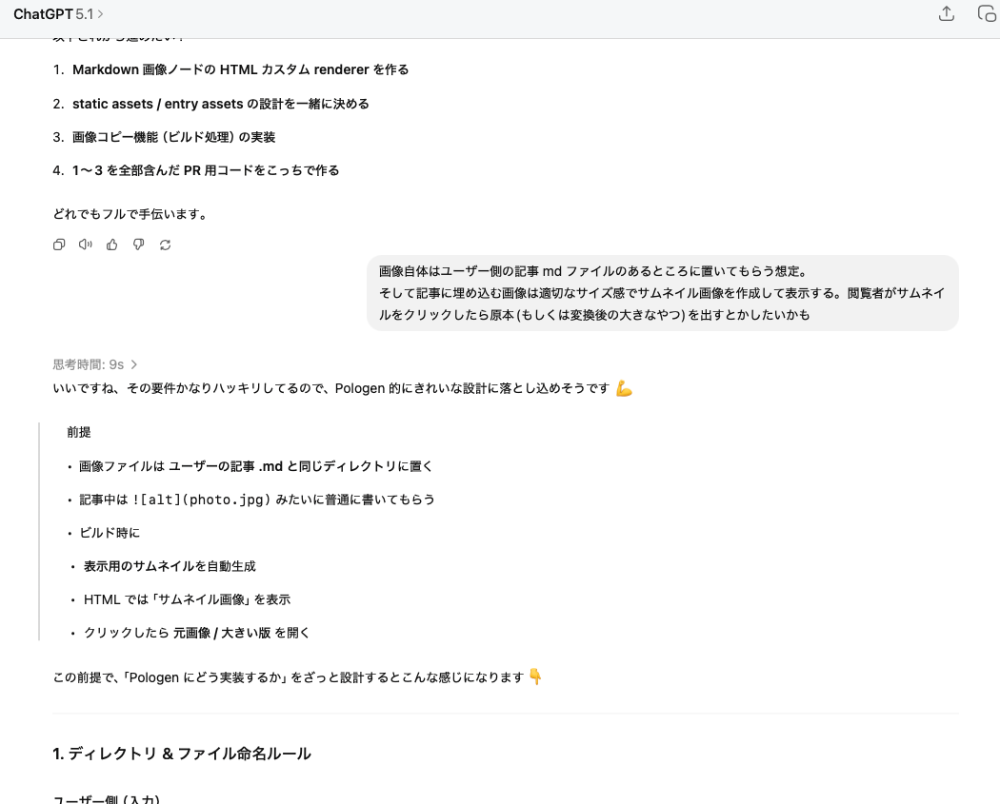
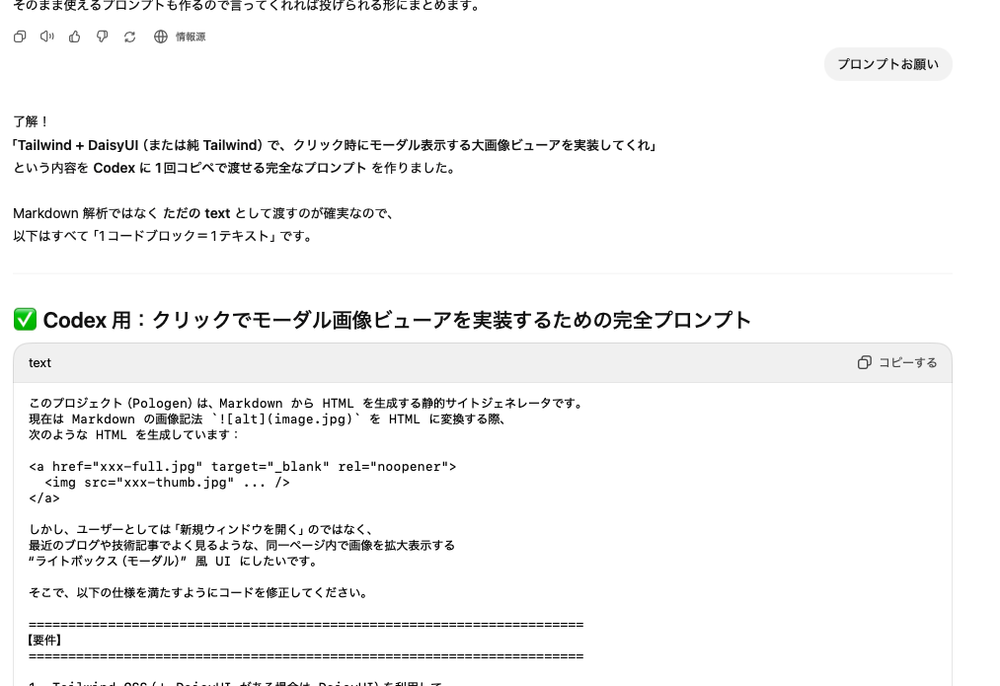
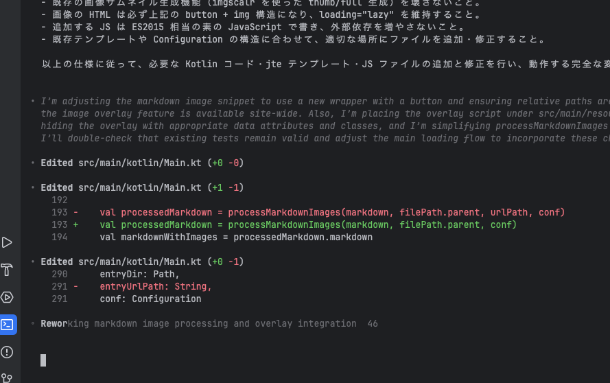
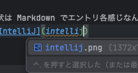

Pologen で Tailwind CSS & daisy UI を使うようにしたよ！ Template Engine も変えたよ！！
JJUG CCC 2025 Fall に行って意識が高まってたので [Pologen](https://github.com/yappo/Pologen) を色々と更新してたのでした。

大きな課題としては

- HTML Template を別ファイルにしたかった
- RSS Feed もちゃんとしたかった
- サイト情報とか著者情報がハードコーディングされすぎてて設定可能にしたかった
- 画像もちゃんとハンドリングしたかった
- X へ簡単にシェアしたかった
- CSS Framework ちゃんと対応したかった

などなど色々課題があったので

ChatGPT に色々聞きながら方針を決めつつ。。

Codex に実装してもらう。実装用のプロンプトは ChatGPT 側に色々相談してプロンプトを作ってもらう。

などなどをしていくうちにいい感じになりました。

- Tailwind CSS & daisy UI
- jte (Java Template Engine)
- imagescalar

あたりを使ってます。
モダンでナウイやつでいっちょよろ！！！って言っていい感じに仕上げてもらいました。

現状は Markdown でエントリ各感じなんで IntelliJ で書いてるとこんな感じでプレビューしながらかけて楽。IntteliJじゃなくていいけど。。

画像ファイル名もサジェストしてくれていい感じよねー
