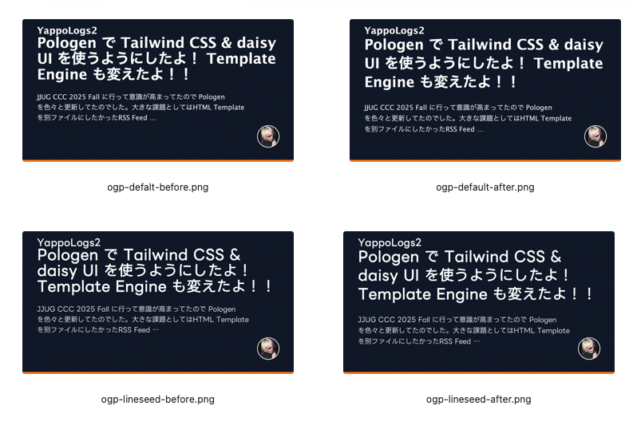
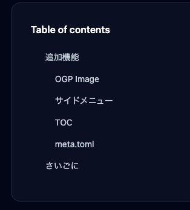

ブログにサイドメニューを追加したよ！！
CSS Frameworkも取り入れてちょっとは見やすくなったのでいい気になってサイドメニューも追加してみたのでした。

あとOGP画像も対応です。

## 追加機能

### OGP Image

モダンな記事サイトだとSNS に投稿すると記事タイトルとか内容を一枚の画像にして共有してくれるあれあるじゃ無いですか。

それ作ってみました。[OGPGenerator.kt](https://github.com/yappo/Pologen/blob/main/src/main/kotlin/OGPGenerator.kt)を見ると分かるんですが、なんかすっごい頑張ってる。。。
ChatGPT-5.1 にソースコード見せて Zenn とかでやってるOGP画像作りたいよ〜いい感じでやって！って言って考えてもらって、ある程度まとまったら「Codexに書いてもらうからプロンプト作って」って言って書いてもらってる感じなので、あんま頑張ってない。

デフォルトのフォントでも日本語の画像作ってくれますが、好きなフォントがあればフォントファイルのパスを設定ファイルに書いとけば使ってくれます。

#### 微調整方法など

標準だと SansSerif 使っといてという実装にしてて、自分用に LINE Seed 使ってみたら結構窮屈だったので、比較画像を ChatGPT に渡して「これどう思う？いい感じになる？調整してCodexのプロンプト書いて」ってお願いしたらいい感じになりました。
一生人任せ！！！

上が SansSerif で下が LINE Seed そして左が調整前で右が調整後です。
なんも考えないでもデザインまでやってくれるなんて、、、描きたくない類の細かいコードまで書いてくれて。。。

### サイドメニュー

丸っとサイドメニューも追加です。

- 著者情報
- 最新エントリ
- リンク集
- 目次

といったものを入れてあります。よくあるやつですね。

### TOC

目次もモダンな感じで実装してもらったが、思ったように動かないので後日マシにしたい。。。

### meta.toml

直近のエントリリストもサイドメニューに出すようにしたので、今後エントリが増えた時に最適化しやすいようにメタデータを少し増やした。
使うかどうかはわからない。。。

## さいごに

丸っと一回のプロンプトでサイドメニュー作ろうとしたので、だいぶ限界だった感ある。。
実装の不備を指摘するとめちゃくちゃ場当たりな事をくりかえすモードになるんで中々手厳しいけど、、まあ。。。。