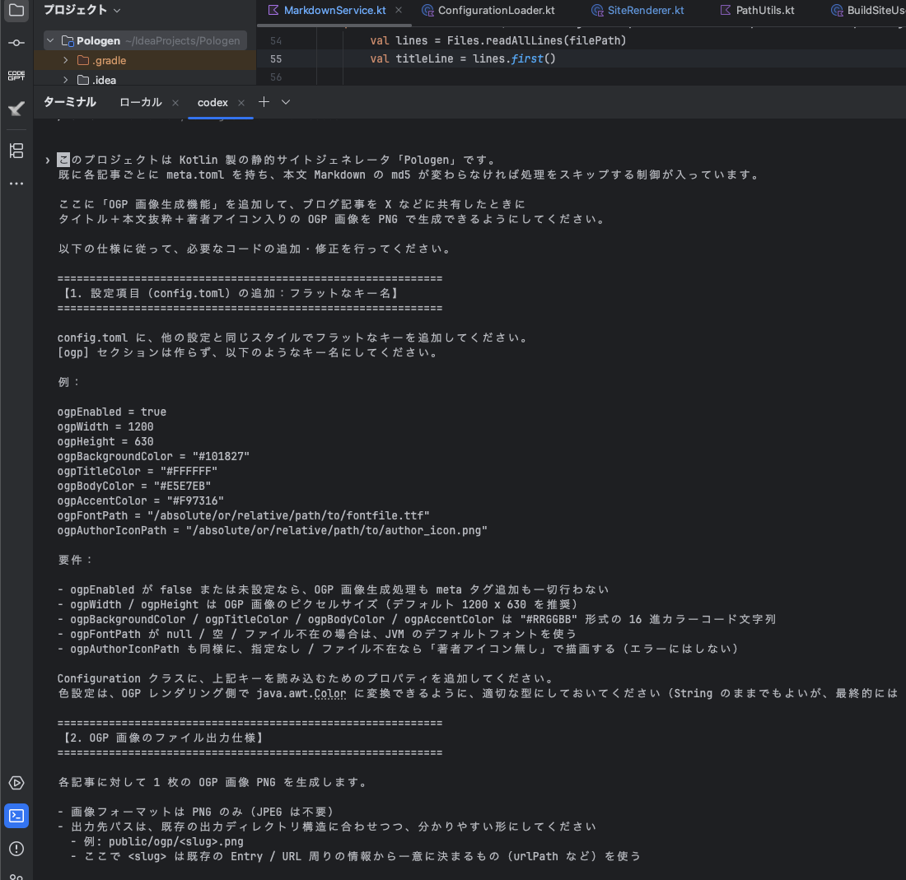
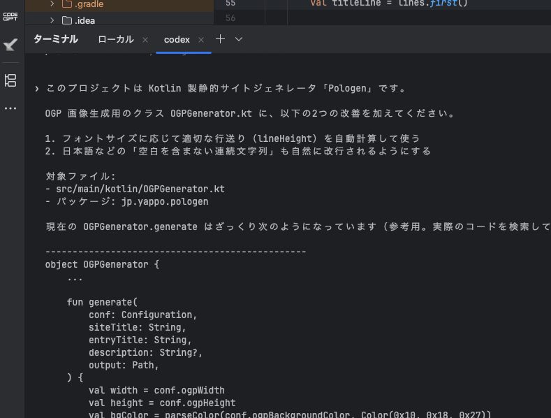

生成AI時代のOGP画像生成にはHeadless Browserは不要説
ここまでずっとBlog生成ツールの開発日誌ばっかだったけど、いい加減そろそろ普通のことでも描こうかと思って。

## TL;DR

なんだかんだで作るのが大変なOGP画像生成の実装を生成AIにやらせたら案外良い感じに作れるかもね？と思いついて作ってみただけの日記。

## OGP画像って作るのめんどいよね

各種Webサイトの実装にあたってSNSでの拡散性を狙って Permalink のOGP画像をコンテンツの内容に合わせて自動生成したいという要求って結構あると思うんですよね。
画像自動生成って結構どころかちゃんと作るとだいぶ面倒くさくて割と大変なんすよね、うっかりするとすぐメモリリークしちゃうし。。

メモリリークは置いといてもデザインとかフォントとか文字数とか色々レイアウト考えると、まーまーカロリー高い実装にはなる訳で、、

じゃあ HTML/CSS でデザイン組んでスクショ撮っちゃえば良い感じに作れるんじゃね？ってことで Headless Browser 使って全自動OGP画像システムを実装して運用してたりするんです。
が、トラフィックが多いと大変になってくるのでクラスタ管理とかして快適なサービスを提供できるように努力してたりするんですよね。

## OGP画像生成 PaaS とかあったら楽なのにねー

ここ数年はNode.js とかで動かすなら[@vercel/og](https://vercel.com/docs/og-image-generation)ってやつもあるらしいけどちゃんと調べておらずだけど、どんどん簡単になって欲しい。

PaaS で提供されるんなら CDN 対応とかも自動的にやってくれそうでめっちゃ良いよね。でも、個人で使うにはオーバーすぎるんかね？

## 自家用OGP画像生成エンジンを作ってみた 

まぁ、そんなこんなで自分も自家用のBlogツール書いてるので、そろそろOGP画像欲しいなと思って作りだしたのでした。

作りだしたと言っても ChatGPT アプリと IntelliJ を連携しつつ、 GitHub の URL を ChatGPT に投げつけてから「このプロジェクトに OGP どうしたらいいん？」って聞いて、色々と相談した後に「じゃぁ、ここから先は Codex 君に書いてもらうからプロンプト作って！」と言って指示して出てきたプロンプトを Codex に投げたら出来たというところ。

## そんな簡単にもいかず。。

とはいえ、一発で出来たら文明すげえ！となるんですが、そこはうまくいかないのが世の常。。

なので、どこが悪いかをちょっとみながら基本的に ChatGPT に問題解決を丸投げしつつまずい点を直していきます。

徐々に徐々に、良い感じになっていきます。

## やれたこと

具体的にはどういうことをしていったかというと

- 使用するフォントをユーザが好きなフォントを利用できるようにする
- ユーザのアイコンを良い感じに配置する
- 色味や配置などもAIのセンスで良い感じにしてもらう

などなどをしていった。

自前で書く時だるそうな点として

- フォント毎の幅を計算して適切に改行する
- 縦横の描画エリアに収まるように良い感じに配置する
- 別のフォントを指定したときにレイアウトが崩れるのをなんとかしてもらう

みたいなところがだるいポイントなので、そこを全部考えて細かく調整して配置してくれたのでよかった。

以下のように、フォントを別のものに変えちゃうと若干微妙になるんだけど、それも ChatGPT の方に生成されたOGP画像を見せて要望を伝えて Codex に渡すプロンプトを書いてもらったら割と良い感じになった。

成果物としては[OGPGenerator.kt](https://github.com/yappo/Pologen/blob/main/src/main/kotlin/OGPGenerator.kt)に置いてあります。

## やれそうなこと

今回はサイト名、エントリタイトル、記事サマリー、著者アイコンの要素を入れるだけのものを作ってもらったんだけど、もっと細かい適切な指示を与えればめんどくさい描画処理のための実装をつくといてくれそうな気がする。

ちょっと凝った事やらせたいとなっても、細かい要望を伝えつつ実装してもらうと良い感じのOGP画像生成処理は誰でも作れそうですね。

## 考えてないこと

もろもろのぱふぉーまんす

## まとめ

ということで、生成AIにOGP画像生成の処理を気軽に書いてもらったらそこそこ良い感じのものが出来ましたという話でした。

通常の Chat UI の生成AIに色々相談してプロンプト書いてもらってから実装に特化した生成AIに丸っと投げると割と良い感じで進むような気がしています。
というか、さらに脳みそを使わずに生成AIに丸投げできるというだけなのかもしれない。
まぁ、だんだん埒があかなくなるんで最終的にはコード読んでマジレスするとかはしなきゃなんで文明はまだまだ未発展です。

お手軽さでいうと HTML/CSS に勝てるかというと怪しいけど、、、